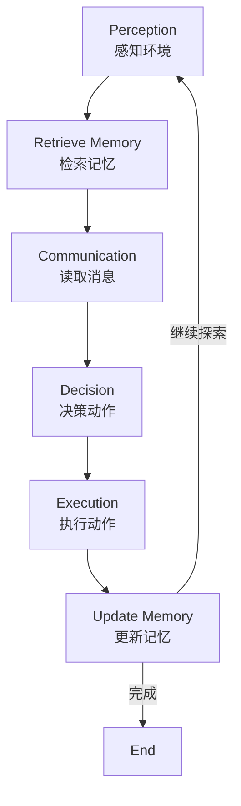

# Design Doc: Multi-Agent XR Environment Exploration

## Requirements

构建一个最简单的多智能体协作系统，用于XR环境探索：
- **两个Agent**：职责相同，在虚拟环境中自主探索
- **目标**：尽可能与更多场景物体交互，避免重复探索
- **动作空间**：前进、后退
- **记忆系统**：使用FAISS向量数据库存储探索历史
- **通信**：Agent之间能够共享发现的信息

## Flow Design

### Applicable Design Pattern

1. **Multi-Agent**: 两个agent并行运行，各自独立决策但共享环境状态
2. **RAG (Retrieval Augmented Generation)**: 
   - 每个agent使用FAISS存储探索记忆
   - 决策时检索相关历史，避免重复探索
3. **Agent**: 自主决策循环
   - *Context*: 当前位置、可见物体、历史记忆、其他agent消息
   - *Action*: 前进、后退

### Flow High-level Design

每个Agent的决策循环（6个节点）：

1. **PerceptionNode**: 感知当前环境（位置、可见物体）
2. **RetrieveMemoryNode**: 从FAISS检索相关探索历史
3. **CommunicationNode**: 读取其他agent的消息
4. **DecisionNode**: 基于上下文决策下一步动作
5. **ExecutionNode**: 执行动作，更新环境位置
6. **UpdateMemoryNode**: 将新探索信息存入FAISS



**并行运行**：两个agent各自运行独立的Flow，通过全局环境和消息队列通信。

## Utility Functions

1. **LLM调用** (`utils/call_llm.py`)
   - *Input*: prompt (str)
   - *Output*: response (str)
   - *Necessity*: DecisionNode使用LLM进行动作决策
   - *Implementation*: 使用Google Gemini Flash（速度快且便宜）

2. **Embedding** (`utils/embedding.py`)
   - *Input*: text (str)
   - *Output*: vector (list of floats)
   - *Necessity*: 将探索记录转换为向量存入FAISS
   - *Implementation*: 使用sentence-transformers的轻量级模型

3. **Memory管理** (`utils/memory.py`)
   - *Functions*: 
     - `create_memory()`: 创建FAISS索引
     - `add_to_memory(index, embedding, text)`: 添加记忆
     - `search_memory(index, query_embedding, top_k)`: 检索记忆
   - *Necessity*: RetrieveMemoryNode和UpdateMemoryNode使用
   - *Implementation*: 使用faiss-cpu

4. **感知接口抽象层** (`utils/perception_interface.py`) ⭐ **核心设计**
   - *Interface*: `PerceptionInterface` (抽象基类)
     - `get_visible_objects(agent_id, position)`: 获取可见物体
     - `get_agent_state(agent_id)`: 获取Agent状态
     - `execute_action(agent_id, action, params)`: 执行动作
     - `get_environment_info()`: 获取环境信息
   
   - *Implementations*:
     - **`MockPerception`**: 模拟感知（开发/测试用）
       - 使用简单字典模拟环境
       - 一维线性空间，每个位置有1-3个物体
     
     - **`XRPerception`**: 真实XR应用感知（生产用）
       - 连接真实XR应用的API/SDK
       - 需要根据具体XR平台实现（Unity/Unreal/WebXR等）
       - 待接入实际XR软件后实现
   
   - *Factory*: `create_perception(type, **kwargs)` 工厂函数
   
   - *Necessity*: PerceptionNode和ExecutionNode使用
   - *Why*: 
     - 分离感知逻辑与框架逻辑
     - 轻松切换模拟环境和真实XR应用
     - 易于测试和扩展

5. **Environment工具** (`utils/environment.py`)
   - *Functions*:
     - `create_environment()`: 创建模拟环境
     - `add_message()`: 添加Agent间消息
     - `get_messages_for()`: 获取Agent消息
   - *Necessity*: 消息通信使用
   - *Implementation*: 简单的消息队列实现

## Data Design

### Shared Store - 全局环境

```python
global_env = {
    "objects": ["chair", "table", "lamp", "book", "cup", ...],  # 环境中的物体
    "agent_positions": {
        "agent1": 0,  # agent1当前位置索引
        "agent2": 0   # agent2当前位置索引
    },
    "message_queue": [],  # [(sender, message), ...]
    "max_steps": 20,  # 最大探索步数
    "explored_by_all": set()  # 所有agent探索过的物体（去重）
}
```

### Shared Store - Agent私有存储

```python
agent_shared = {
    "agent_id": "agent1",
    "global_env": global_env,  # 全局环境引用
    "perception": perception,  # 感知接口实例（MockPerception或XRPerception）
    "position": 0,
    "step_count": 0,
    
    # 记忆系统
    "memory_index": None,  # FAISS索引对象
    "memory_texts": [],    # 对应的文本记录
    
    # 当前状态
    "visible_objects": [],
    "retrieved_memories": [],
    "other_agent_messages": [],
    
    # 决策结果
    "action": None,  # "forward" or "backward"
    "action_reason": "",
    "message_to_others": "",
    
    # 探索历史
    "explored_objects": set(),
    "action_history": []
}
```

## Node Design

### 1. PerceptionNode ⭐ **已重构使用感知接口**
- *Type*: Regular Node
- *prep*: 读取`perception`接口、`agent_id`和`position`
- *exec*: 调用`perception.get_visible_objects(agent_id, position)`获取可见物体
  - 模拟环境：从字典读取
  - 真实XR：调用XR应用API获取场景数据
- *post*: 写入`visible_objects`到shared

### 2. RetrieveMemoryNode
- *Type*: Regular Node
- *prep*: 读取`visible_objects`，构造查询文本
- *exec*: 
  - 调用`get_embedding()`获取查询向量
  - 调用`search_memory()`检索相关历史
- *post*: 写入`retrieved_memories`到shared

### 3. CommunicationNode
- *Type*: Regular Node
- *prep*: 读取global_env的`message_queue`
- *exec*: 过滤出发给当前agent的消息
- *post*: 写入`other_agent_messages`到shared，清空已读消息

### 4. DecisionNode
- *Type*: Regular Node，max_retries=3
- *prep*: 读取`visible_objects`, `retrieved_memories`, `other_agent_messages`, `position`
- *exec*: 
  - 构造prompt（包含所有上下文）
  - 调用`call_llm()`获取结构化决策（YAML格式）
  - 验证action字段（"forward" or "backward"）
- *post*: 写入`action`和`action_reason`到shared

### 5. ExecutionNode ⭐ **已重构使用感知接口**
- *Type*: Regular Node
- *prep*: 读取`perception`接口、`agent_id`和`action`
- *exec*: 调用`perception.execute_action(agent_id, action)`执行动作
  - 模拟环境：更新字典中的位置
  - 真实XR：调用XR应用API执行Agent动作
  - 返回新状态（包含position、visible_objects等）
- *post*: 
  - 更新shared中的`position`、`visible_objects`和`step_count`
  - 发送消息到message_queue告知其他agent

### 6. UpdateMemoryNode
- *Type*: Regular Node
- *prep*: 读取`visible_objects`, `action`, `action_reason`
- *exec*:
  - 构造记忆文本
  - 调用`get_embedding()`
  - 调用`add_to_memory()`
- *post*: 
  - 更新`explored_objects`
  - 更新`action_history`
  - 判断是否继续探索（检查step_count）
  - 返回"continue"或"end"

## Implementation Notes

- **并行运行**：使用Python的threading让两个agent并行运行
- **感知抽象层**：⭐ **核心设计改进**
  - 定义了`PerceptionInterface`抽象基类
  - 当前使用`MockPerception`模拟环境（开发/测试）
  - 预留`XRPerception`接口（待接入真实XR应用）
  - 通过工厂函数`create_perception()`轻松切换
- **简单环境**：一维数组模拟环境，每个位置有1-3个物体（仅用于模拟）
- **LLM**：使用Gemini 2.0 Flash（最快最便宜）
- **Embedding**：使用`all-MiniLM-L6-v2`（轻量快速）
- **同步机制**：使用Lock保护共享资源（消息队列等）

## 接入真实XR应用的步骤

1. **确定XR平台**：Unity、Unreal Engine、WebXR等
2. **实现XRPerception类**：
   ```python
   # 在 utils/perception_interface.py 中
   class XRPerception(PerceptionInterface):
       def __init__(self, xr_client):
           self.xr_client = xr_client  # XR应用的客户端连接
       
       def get_visible_objects(self, agent_id, position):
           # 调用XR应用API获取场景数据
           scene_data = self.xr_client.get_scene(agent_id)
           return scene_data.visible_objects
       
       def execute_action(self, agent_id, action, params):
           # 调用XR应用API执行动作
           result = self.xr_client.execute_action(agent_id, action)
           return {"position": result.new_position, ...}
   ```
3. **在main.py中切换**：
   ```python
   # 使用真实XR感知
   xr_client = YourXRClient(host="localhost", port=8080)
   perception = create_perception("xr", xr_client=xr_client)
   ```
4. **测试和调试**：先用MockPerception验证框架逻辑，再切换到XRPerception

